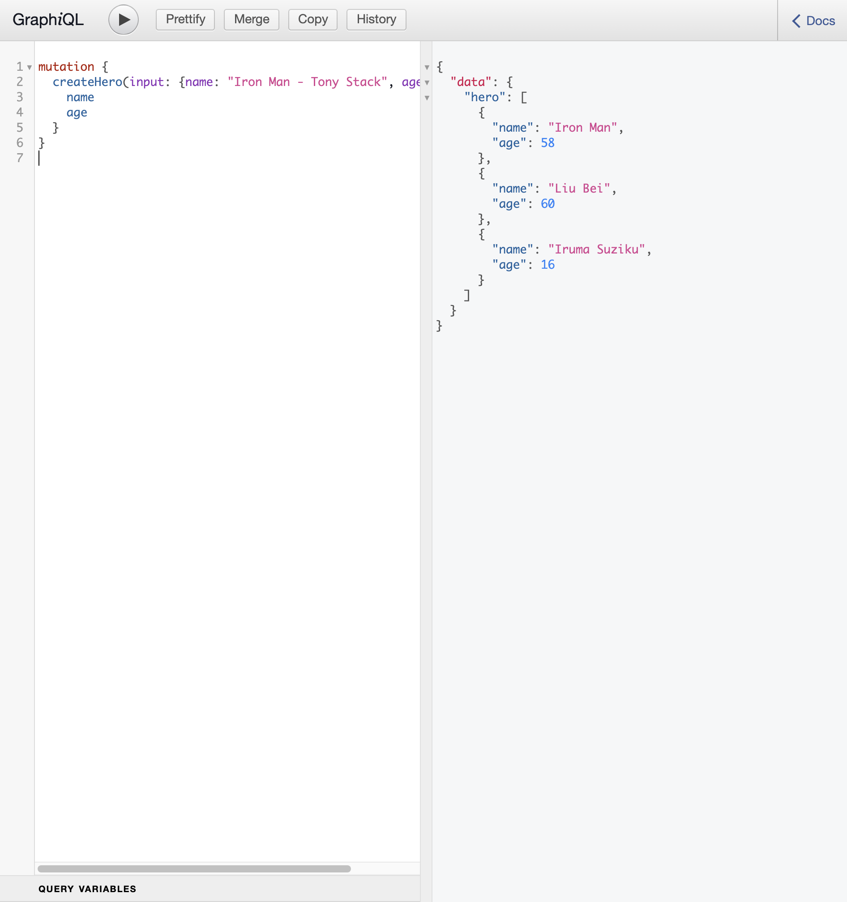
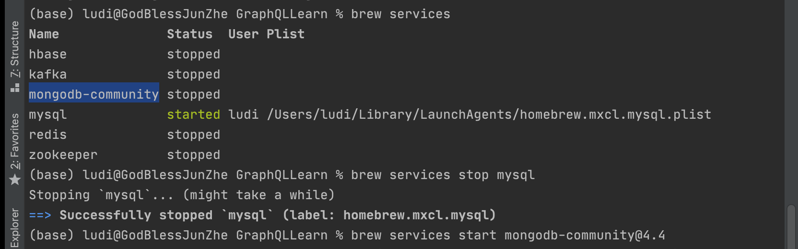
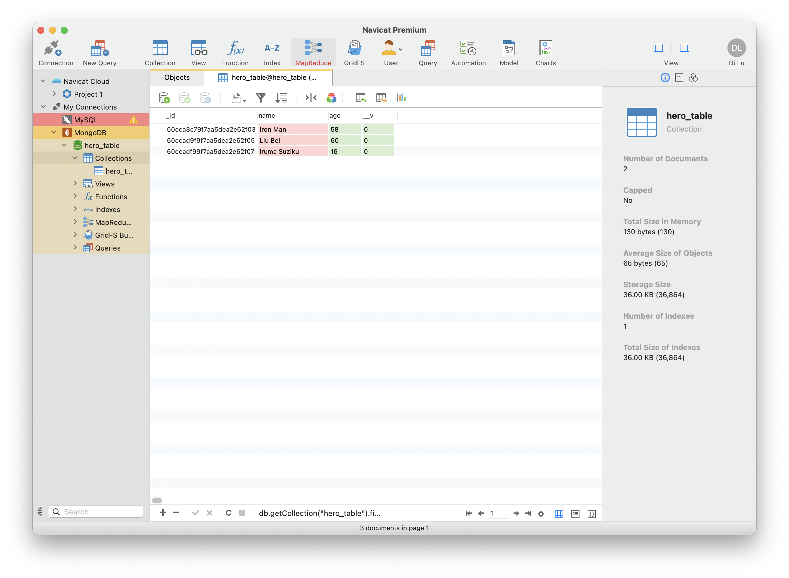

# The learing process of GRAPHQL

GraphQL is a query language for APIs and a runtime for fulfilling those queries with your existing data. GraphQL provides a complete and understandable description of the data in your API, gives clients the power to ask for exactly what they need and nothing more, makes it easier to evolve APIs over time, and enables powerful developer tools.

---
# the learning process includes:


1. the usage of express and graphQL application

<a href="src/hello.js">Hello.js</a>
```
const express = require('express')
const { buildSchema } = require('graphql')
const { graphqlHTTP } = require('express-graphql')
```
2. the link of front end to fetch graphql 

<a href="public/index.html">index.html</a>

3. connect to mongoDB database and CRUD

<a href="src/db.js">db.js</a>

---
# building process(Node.js)
```
npm init -y
npm install express graphql express-graphql -S
npm install nodemon
```
change 'start' configuration in ```package.json``` to ```nodemon```

in ```package.json``` you can edit enter point of the source file.

./src/db.js

./src/hello.js

# running

```
npm start
```

```nodemon``` will synchronize and update the project.

# visit GRAPHQL web application

```
http://localhost:3001/graphiql
```


# start mongoDB

```
brew services start mongodb-community@4.4
```


mongo DB path:

```
const DB_PATH = 'mongodb://127.0.0.1:27017/hero_table'
```

## tools
** navicat **

collective GUI of database




## some queries
```mutation
mutation {
  createHero(input: {name: "Iron Man - Tony Stack", age: 55}) {
    name
    age
  }
}

mutation {
  updateHero(hero:"Iron Man - Tony Stack",input: {name: "Iron Man", age: 58}) {
    name
    age
  }
}

```

```query
query{
  hero{
    name
    age
  }
}
```

<br>
<br>
<br>

## Notes

### 1. schema and Types:

**1.1 Query:**

The entering point for all queries. You can only have and must have one Query.

**1.2 Scalar Types:**

* Int : Integer
* Float : Double precise Float
* String : UTF-8 character serial
* Boolean : true/false
* ID : Global Unique Identification, mostly used to query objects or for caching. Serialized as a **String**.

**1.3 Object Types and Fields:**

Self-defined objects.

Schema=>
```
const schema = buildSchema(`
    Type User{
        name: String
        age: Int
}`)
```
Root=>
```
const root = {
    user(){
        return {name:"jack", age:18}
    }
}
```
Query=>
```Query
{
    user{
        name
        age
    }
}
```

**1.4 Array Types:**
```
Type Score{
    name: String
    score: Float
}

User{
    name: String
    hobbies: [String]
    score: [Scores]
}
```

If an object is nested, the fields must be specified when quering.


**1.5 Not Null Type**
```
Type Score{
    name: String
    score: Float
}

User{
    name: String!
    hobbies: [String!]!
    score: [Scores]
}
```
```!```means not null requirements.

```[]!```(Outer) Array Not Null

```[!]```(inner) array elements not null

**1.6 Read/Find operation**

mock data=>
```
const articles = [
{id:'1', title: 'article 1', body: 'article 1 body.'},
{id:'2', title: 'article 2', body: 'article 2 body.'},
{id:'3', title: 'article 3', body: 'article 3 body.'}
]
```
schema=>
```
Type Query{
    article(id:ID!): Article
}
```
root=>
```
const root = {
    article({ id }}){
        return articles.find(article => article.id === id)
    }
}

```

query=>
```
{
    article(id:'1'){
        title
    }
}
```

**1.7 Create/Update/Delete operation : Mutation**
```
Type Mutation{
    createArticle(title: String!, body: String!): Article,
}
```
root=>
```
const root = {
    createArticle({title, body}){
        return null
    }
}

```
Mutation=>
```
mutation {
    createArticle(title:"AA", body:"AA body"){
        id
        title
        body
    }
}
```
We can collect arguments as a special type **input**

schema=>
``` type
input CreateArticleInput{
    title: String!
    body: String!
    taglist: [string!]
}
input updateArticle{
    title: String!
    body: String!
}
type DeletionStatus{
    success: Boolean!
}

Type Mutation{
    createArticle(article:CreateArticleInput!): Article,
    updateArticle(id: ID, article:UpdateArticleInput!): Article,
    deleteArticle(id: ID): DeletionStatus
}
```

root=>
``` root
const root = {
    createArticle( {article} ){
        article.id = uuidv4()
        articles.push(article)
        return article
    }
    updateArticle( {id，article : postArticle} ){
        articles.find(findArticle => article.id === id)
        findArticle.title = postArticle.title
        findArticle.body = postArticle.body
        return findArticle
    }
    deleteArticle( {id} ){
        articles.find(findArticle => article.id === id)
        findArticle.splice(index,1)
        return {success: true}
    }
}
```
Mutation=>
```
mutation {
    createArticle(article: {title:"AA",body:"AA body",taglist:["tag1","tag2"]} ){
        id
        title
        body
    }
    updateArticle(id:'3',article: {title:"CC",body:"CC body",taglist:["tag1","tag2"]} ){
        id
        title
        body
    }
    deleteArticle( id:'3' ){
        success
    }
}
```
### 2. frontend Application

Template:

```
<script>
    axios({
        method:'POST'
        url:'http://localhost:3000/graphql'
        data:{
            query:``
        }
    }).then(res => {
        console.log(res.data)
    })
</script>
```

It is suggested that each query be given a special name.
**Get**
String / param concat
```
const id = 1
query getArticle(){
    article(id:${id}){
        id
        title
    }
}
```
=> param variable $id
=> pass variable to data
```
<script>
    axios({
        method:'POST'
        url:'http://localhost:3000/graphql'
        data:{
            query:`
                query getArticle($id:ID!){
                    article( id : $id ){
                        id
                        title
                    }
                }
            `,
            variables : {
                id: 1
            }).then(res => {
                    console.log(res.data)
                })
</script>
```
**Create**
```
<script>
    axios({
        method:'POST'
        url:'http://localhost:3000/graphql'
        data:{
            query:`
                mutation createArticle($article:CreateArticleInput!){
                    createArticle( article : $article ){
                        id
                        title
                        body
                    }
                }
            `,
            variables : {
                article: {
                    title: "DD",
                    body: "DD body",
                    taglist: ["nature","flower"]
                }
            }).then(res => {
                 console.log(res.data)
             })
</script>
```
**Update**
```
<script>
    axios({
        method:'POST'
        url:'http://localhost:3000/graphql'
        data:{
            query:`
                mutation updateArticle($id:ID,$article:UpdateArticleInput!){
                    updateArticle( id: $id, article : $article ){
                        id
                        title
                        body
                    }
                }
            `,
            variables : {
                id: 3,
                article: {
                    title: "DD",
                    body: "DD body"
                }
            }).then(res => {
                 console.log(res.data)
             })
</script>
```
**Delete**
```
<script>
    axios({
        method:'POST'
        url:'http://localhost:3000/graphql'
        data:{
            query:`
                mutation deleteArticle($id: ID){
                    updateArticle( id: $id ){
                        success
                    }
                }
            `,
            variables : {
                id: 2,
            }
</script>
```


---


---
© Di Lu