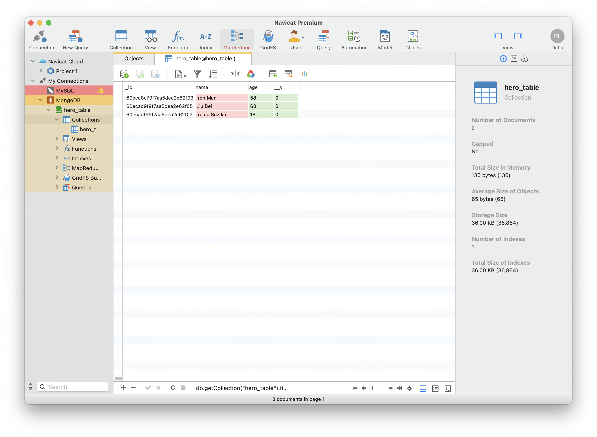

# The learing process of GRAPHQL

GraphQL is a query language for APIs and a runtime for fulfilling those queries with your existing data. GraphQL provides a complete and understandable description of the data in your API, gives clients the power to ask for exactly what they need and nothing more, makes it easier to evolve APIs over time, and enables powerful developer tools.

---

# running

in ```package.json``` you can edit enter point of the source file.

./src/db.js

./src/hello.js

# visit GRAPHQL web application

```
http://localhost:3001/graphiql
```

# start mongoDB

```
brew services start mongodb-community@4.4
```

mongo DB path:

```
const DB_PATH = 'mongodb://127.0.0.1:27017/hero_table'
```

## tools
** navicat **

collective GUI of database




## some queries
```mutation
mutation {
  createHero(input: {name: "Iron Man - Tony Stack", age: 55}) {
    name
    age
  }
}

mutation {
  updateHero(hero:"Iron Man - Tony Stack",input: {name: "Iron Man", age: 58}) {
    name
    age
  }
}

```

```query
query{
  hero{
    name
    age
  }
}
```

---

© Di Lu